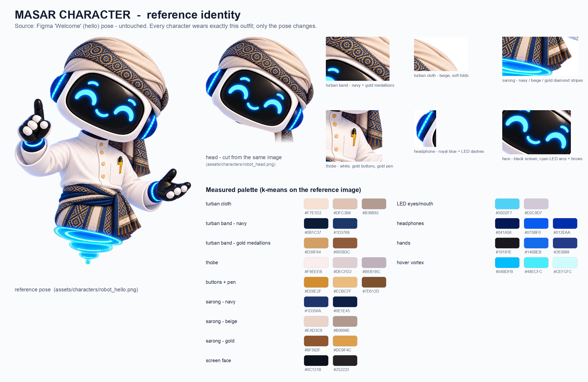

# 🧕 هويةُ شخصية مسار — المرجعُ الوحيد

> **قاعدةُ المالك (٢٠٢٦-٠٩-٢٦):** الروبوت واحدٌ في كل مكان — **نفسُ العمامة، نفسُ الثوب،
> نفسُ الوزرة (المعوز)، نفسُ الألوان، نفسُ النقوش بكل التفاصيل**. الذي يتغيّر **الوضعيةُ
> فقط** (والحركة). تُقرأ هذه الصفحة قبل استخراج أي شخصية من Figma أو إنشاء أي روبوت.

## المرجع

| الملف | ما هو |
|---|---|
| `reference_hello_original.png` | شخصية «مرحباً» كما رفعها المصمّم (1159×1358، شفافية) — **لا تُعدَّل أبداً** |
| `head.png` | الرأسُ مقصوصاً **من الصورة نفسها** (`tools/cut_head.py`) — للبداية وكل موضعٍ يلزمه رأسٌ وحده |
| `palette.json` | الألوانُ مقيسةً بـk-means على المرجع، لكل قطعة |
| `identity_sheet.png` | الورقةُ أعلاه: الوضعيةُ + الرأس + تكبيرُ كل قطعة + العيّنات |

## الزيّ — قطعةً قطعة

**١. العمامة**
- القماش: بيجٌ ورديّ دافئ بطيّاتٍ ناعمة — `#F7E1D2` (ضوء) · `#DFC3B4` (وسط) · `#B39B92` (ظلّ).
- الحزام: شريطٌ عريض يلتفّ قُطرياً من فوق الجبهة إلى الجهة اليمنى من الرأس، أرضيّتُه **كحلية**
  `#0B1C37` / `#1D3768`، وعليه **ميداليّاتٌ دائرية** (زخرفةٌ شمسيّة/وردية) **ذهبيّةٌ مطفأة**
  `#D39F64` / `#905B3C` — لا برتقاليّ ولا أحمر ولا أصفر فاقع.
- الذيل: يتدلّى على الكتف الأيمن بنفس الحزام، وينتهي **بأهدابٍ** كحلية وذهبية.

**٢. الثوب** — أبيضُ دافئ `#F9EEEB` (ظلال `#DECFD2`/`#BEB1BC`)، ياقةٌ قائمة، **أزرارٌ ذهبية**
مستديرة في صفٍّ واحد، وجيبٌ على الصدر فيه **قلمٌ ذهبيّ** `#D28E2F`/`#ECBC7F`.

**٣. الوزرة (المعوز)** — تُلفّ على الخصر بحزامٍ كحليّ معقود، ونقشُها **خطوطٌ طولية** متناوبة:
كحليّ `#1D356A`/`#0E1E45` · بيج `#EAD3C9` · ذهبيٌّ نحاسيّ `#8F562F`/`#DC9F4C` بزخرفة **معيّنات**،
وحافّتُها السفلى أهدابٌ ذهبية.

**٤. الجسد**
- الرأس: قشرةٌ بيضاء لامعة، **شاشةٌ سوداء** `#0C121B`، عينان **قوسان سماويّان** `#50D2F7`
  وفوقهما **حاجبان** قوسان صغيران، وفمٌ قوسٌ مبتسم. الوجهُ مبتسمٌ دائماً.
- السمّاعتان: **أزرق ملكيّ** `#075BF0`/`#012EAA` بخطّ LED متقطّع.
- اليدان: قفّازان أسودان `#19181E` بمفاصلَ بيضاء، وسوارُ LED أزرق عند المعصم.
- لا ساقين: يطفو على **دوّامة ضوء** سماوية `#04BDFB`/`#48ECFC`.

## ما يجوز تغييرُه وما لا يجوز

| ✅ يتغيّر | ⛔ لا يتغيّر |
|---|---|
| الوضعية · حركةُ اليدين · ميلُ الرأس | ألوانُ أي قطعة (القيمُ أعلاه) |
| ما في اليد (كتاب، لوح، قبّعة تخرّج…) | نقشُ الحزام (ميداليّات) ونقشُ الوزرة (خطوط + معيّنات) |
| تعبيرُ الوجه (ضمن الابتسامة) · الرمش | شكلُ العمامة والذيل والأهداب |
| الحركةُ في التطبيق | الثوبُ الأبيض بأزراره وقلمه |

## خطواتُ إضافة شخصيةٍ جديدة

1. اسحب صورةَ المصمّم الأصلية (`GET /v1/files/<key>/images` — يعمل حتى مع حظر `/files`).
2. **قارنها بالورقة أعلاه أولاً.** ليست العمامةُ نفسَها (نقشٌ آخر أو لونٌ آخر)؟ ⇒
   - إن كان رأساً وحده ⇒ لا تُلوّن؛ استعمل `head.png`.
   - إن كانت وضعيةً كاملة ⇒ `tools/match_palette.py` (مرجعُها «مرحباً»): نقلُ لونٍ في Lab
     **لكل عائلة** (بيج · نقوش · كحلي) مع استثناء ما في اليد. ثم قِس وقارن بالعين.
   - ⚠️ **لا إزاحةَ صبغة (hue shift):** الذهبيّ جارُ البرتقاليّ فيُطفأ معه — وقع في
     ٢٠٢٦-٠٩-٢٦ فعكّر النقوشَ والأزرارَ والقلمَ في كل الصور.
3. قُصّ على الحدود وصغّر إلى ٩٦٠ ← رقعةُ الرمش (`tools/blink_v2.py`، مستطيلا العينين باليد:
   الكاشفُ الآلي يلتقط **الحاجبين** والفم) ← سطرٌ في `MasarCharacter`.
4. `flutter test test/masar_character_test.dart` (يتحقّق أن أبعاد الملفات = الـenum) ← المحاكي.

> ⚠️ **حدٌّ صريح:** النقلُ اللونيّ يطابق **الألوان** لا **رسمَ النقش**. كلُّ وضعيةٍ رسمها المصمّم
> بنقشٍ قريبٍ لا مطابق (مثلاً «منح» حزامُها دوائرُ متداخلة لا ميداليّات). المطابقةُ الكاملة
> للنقش تحتاج أن يُرسم الإطار من هذا المرجع — **اطلبه من المصمّم بهذه الورقة**.

## الوضعياتُ المستعملة حتى الآن

| `MasarCharacter` | Figma (fill #) | الشاشة |
|---|---|---|
| `head` | مقصوصٌ من #18 | البداية (مُدارٌ 26.6° ليستقيم — طلب المالك) · الإطلالة من خلف الجوّال (مائلٌ كما هو) |
| `hello` | #18 (المرجع) | الترحيب ١ + فقاعة «هلا!» |
| `ask` | #0 | الترحيب ٢ · «هل تأكّدت من البيانات؟» |
| `guide` | #111 | الترحيب ٣ (منح واختبارات) |
| `login` | #124 | تسجيل الدخول |
| `signup` | #6 | إنشاء حساب |
| `roles` | #71 | مرحباً بك · اختر دورك |
| `forgot` | #93 | نسيت كلمة المرور |
| `reset` | #22 | بعد إرسال رابط التعيين |
| `waiting` | #47 بلا ساعة رملية | **روبوتُ الانتظار المعتمد** — التحقق من البريد، و**«اختبر نفسك» لاحقاً** (قرار المالك). شريطُه يمتلئ حيّاً ببطء (دورة ٨ ث) ثم يرجع |
| `MasarRobotPose.fly` (`assets/brand/robot_fly.png`) | #112 بعمامة «هلا» فقط (`tools/dress_fly.py`) | بطاقة «قسم التعليم» · ترحيبُ محادثة التعليم · بطاقة «اختر دروسك» |
| `teach` | #100 (نقلُ ألوان `tools/match_teach.json` + رمش) | ترحيبُ **مساعد المعلّم** |
| `guide` (أيضاً) | #111 | ترحيبُ **مساعد المنحة** — كما في Figma الحيّ |

أرقامُ الـfill من `GET /v1/files/<key>/images` مرتّبةً بالاسم؛ الأصولُ الخام في `../originals_v2/`.
